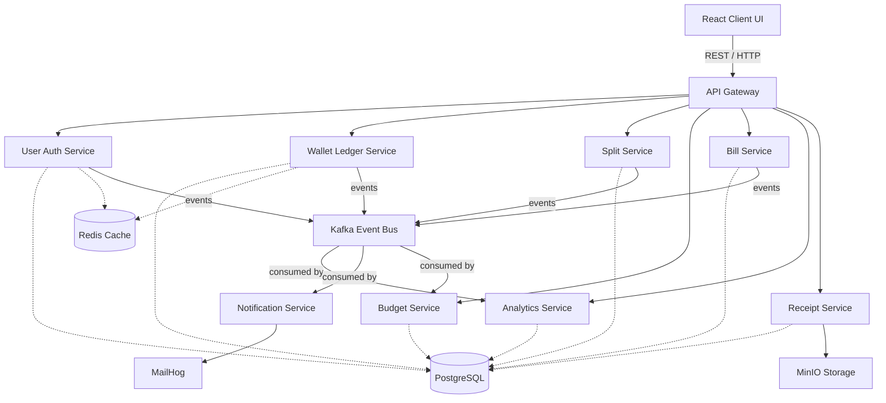
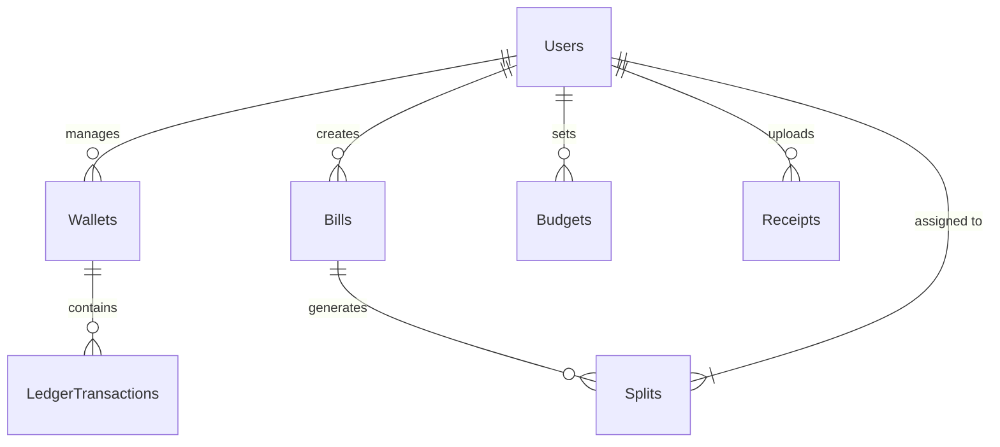
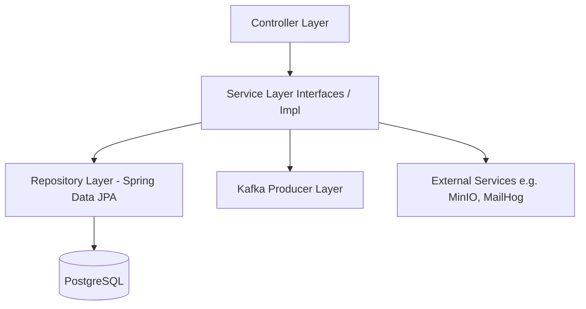
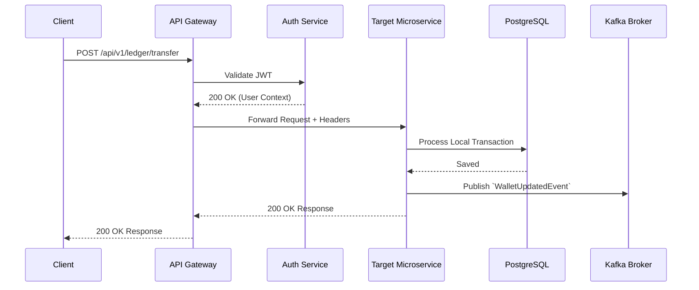

# SmartWallet Architecture


SmartWallet is an event-driven, microservices-based personal finance platform. It enables real-time wallet tracking, splits, budgeting, and automated billing through a scalable backend and a highly responsive React frontend.

## Tech Stack

| Domain | Technologies |
| :--- | :--- |
| **Backend Core** | Java 17, Spring Boot 3.2.x, Spring Cloud |
| **Frontend** | React 18, TypeScript, Vite, TailwindCSS, Zustand |
| **Database** | PostgreSQL 15 |
| **Messaging & Cache** | Apache Kafka 7.5, Redis 7 |
| **Object Storage** | MinIO |
| **Email Testing** | MailHog |
| **Infrastructure**| Docker & Docker Compose |

## System Architecture



### Schema Flow



## Service Layer Structure (The "Brain")

### Pattern Overview
The application follows a Distributed Domain-Driven Design pattern. Inter-service communication relies on **Kafka** for asynchronous, non-blocking events (choreography) and **REST (via API Gateway)** for synchronous data retrieval. Each service maintains its own distinct domain data within PostgreSQL (Database per service pattern), enforcing strong coupling boundaries.

### Service Breakdown

| Service Name | Responsibility | Key Dependencies |
| :--- | :--- | :--- |
| **UserAuthService** (`JwtService`) | JWT Generation, User Identity, Authentication | UserRepository, Redis |
| **WalletLedgerService** (`LedgerService`, `IdempotencyService`) | Wallet balances, robust transaction logging | LedgerRepository, Kafka, Redis |
| **SplitService** (`SplitService`) | Calculate & track shared expenses | SplitRepository, Kafka |
| **BillService** (`BillService`) | Recurring payments and invoice tracking | BillRepository, Kafka |
| **BudgetService** (`BudgetService`) | Expense-limit tracking and thresholds | BudgetRepository, Kafka |
| **AnalyticsService** (`AnalyticsService`) | Spending trends and categorization | AnalyticsRepository, Kafka Consumer |
| **ReceiptService** (`ReceiptService`, `MinioService`) | OCR processing & object storage for uploaded receipts | MinIO, ReceiptRepository |
| **NotificationService** (`EmailService`, `MessagingService`) | Sending alerts, weekly reports, & verification emails | MailHog, Kafka Consumer |

### Dependency Flow



## API & Data Flow

### Request Lifecycle



### API Documentation

| Path | Method | Required Params | Success Response | Error Codes |
| :--- | :--- | :--- | :--- | :--- |
| `/api/v1/auth/login` | `POST` | `email`, `password` | `200 OK` (Returns JWT token) | `401`, `400` |
| `/api/v1/wallets` | `GET` | `Authorization` Header | `200 OK` (Wallet balances) | `401`, `403` |
| `/api/v1/ledger/transfer` | `POST` | `from`, `to`, `amount` | `200 OK` (Transaction ID) | `400`, `404`, `500` |
| `/api/v1/splits` | `POST` | `groupId`, `amounts[]`| `201 Created` | `400`, `401` |
| `/api/v1/receipts/upload` | `POST` | `multipart/form-data` | `201 Created` (Receipt URLs) | `415`, `500` |

## Production & Deployment Flow

### Build Pipeline

1. **Prerequisites**: Java 17 JDK and Maven.
2. **Compile Core Shared Logic**:
   ```bash
   mvn clean install -DskipTests
   ```
   *This compiles the `common-lib` and all underlying application microservices into independently executable JARs.*

### CI/CD Workflow

1. **Linting & Testing**: Triggered on Pull Request against `main`. Runs `mvn test` and UI ESLinting over the services.
2. **Build**: Compiles binaries and constructs Docker Native images for fast cold starts.
3. **Deploy**: The `docker-compose.yml` serves as the primary declarative configuration, pulling pre-bound images and executing the deployment securely.

### Environment Specs (Minimum Production)
- **CPU**: 4 vCPUs (Multi-threading essential for Kafka Consumers).
- **RAM**: 8GB Total minimum (1GB per primary Spring Boot container, 2GB for Kafka/Zookeeper).
- **Storage**: SSD-backed volumes for MinIO Data and PostgreSQL block volumes.

### Troubleshooting Guide

| Issue | Symptom | Resolution / Check |
| :--- | :--- | :--- |
| **CORS Errors** | Preflight UI requests fail | Verify `API Gateway` CORS configuration matches the `VITE_API_BASE_URL`. |
| **DB Connection Timeout** | `PSQLException: Connection refused` | Ensure `smartwallet-postgres` container is fully initialized before the API attempts connection. Check network bounds. |
| **Kafka Broker Unavailable** | `Node ID 1 disconnected` | Check Zookeeper/Controller Quorum configurations. Verify `KAFKA_ADVERTISED_LISTENERS`. |
| **Environment Mismatch** | `Cannot resolve property` | Verify that all `.env` files are imported accurately when executing Docker commands. |
