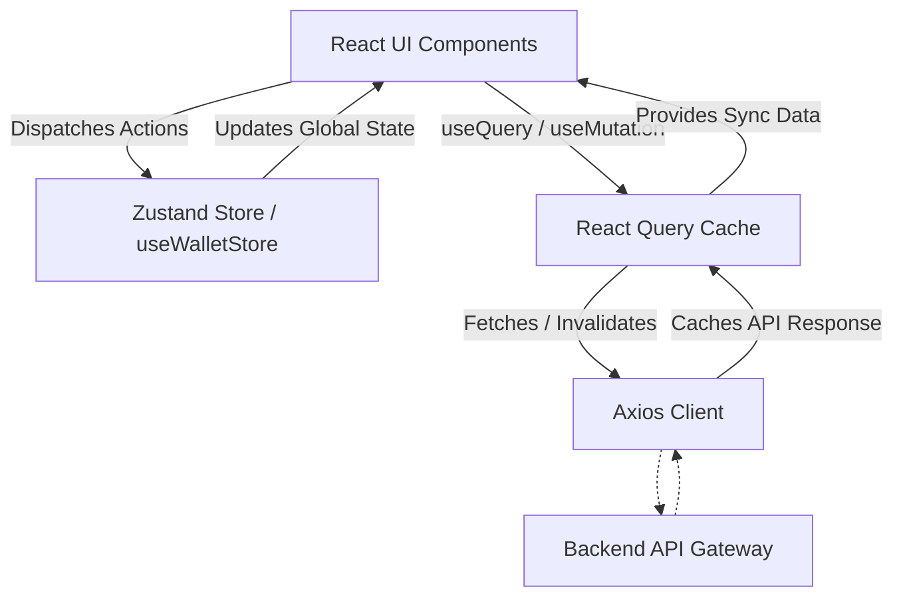

# SmartWallet Frontend Architecture


The SmartWallet frontend provides a rich, responsive, and highly interactive user experience. It directly consumes our event-driven backend microservices via the API Gateway.

## Getting Started

**Node.js Restrictions:** 
This project strictly requires **Node.js 18.x LTS or 20.x LTS**. 

To spin up locally:
```bash
npm install
npm run dev
```

## Component Hierarchy

```text
frontend/src/
├── main.tsx                # Entry point & Providers (React Query, Router)
├── App.tsx                 # Core App Shell & Routing Definitions
├── lib/
│   └── api.ts              # Axios interceptors and typed API calls
├── store/
│   └── useWalletStore.ts   # Zustand Global State
└── components/
    ├── DashboardContent.tsx# Main View Assembly
    └── ui/                 # Reusable, stateless generic components
```

## Component vs. Responsibility Table

| Component | Type | Responsibility |
| :--- | :--- | :--- |
| `App` | Root Layout | Base Routing, Authentication Guards, Context Wrapping |
| `DashboardContent` | Feature | Assembles widgets, charts, and summary data for the main user dashboard |
| `ui/*` | Shared UI | Highly reusable primitive components built on Tailwind (e.g., DataGrid, Buttons) |
| `Navbar` / `Sidebar` | Layout | Primary navigation and user session status rendering |
| `DataGrid` | UI/Shared | Data visualization, sorting, and pagination mapping for massive datasets |

## State Management

Zustand and React Query operate hand-in-hand to separate Server State from Client State.



## API Integration

### Axios and Network Resiliency

All network requests are directed through a central Axios instance housed in `lib/api.ts`. This ensures consistent token injection and global error handling across the entire React application.

- **Request Interceptors**: Appends the active JWT token located in memory/localStorage to the `Authorization: Bearer <token>` header for every outgoing HTTP action.
- **Response Interceptors (401/403 Handling)**: 
  - If a requested resource yields an `HTTP 401 Unauthorized` or `HTTP 403 Forbidden`, the global interceptor automatically intercepts the failure, evicts the expired or invalid tokens from local storage, and forcefully redirects the application viewport to the `/login` route. This secures the application state seamlessly without requiring developer overhead to manually catch these errors on individual API logic implementations.
